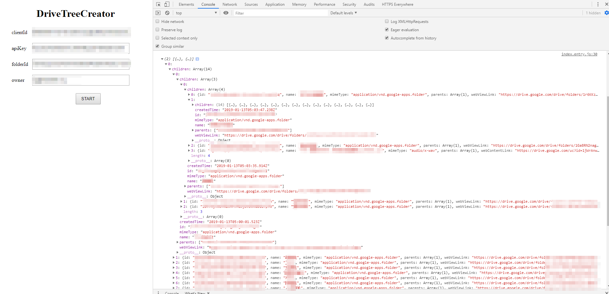
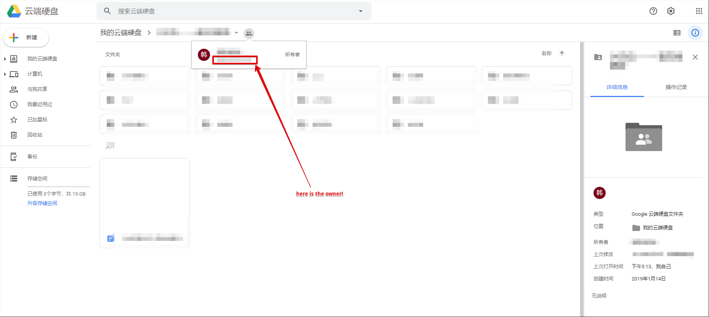

# DriveTreeCreator.js
pretty easy way to create a ton of folder tree from google drive

# License


# Example


# CND
not have yet

# Usage
[actually i written a post about compares to 3 ways to get google drive tree structure](https://carljin.com/list-all-google-drive-files-and-folders.html)

```javascript
//  all code use ES6

//  step 1
//  import DriveTreeCreator to u project

import DriveTreeCreator from './DriveTreeCreator'

(async ()=>{


//  step 2
//  get Instance from DriveTreeCreator
let D = new DriveTreeCreator({
    googleAPI: {
      clientId: '',
      apiKey: '',
      folderId: '',
      owner: ''
    }
  })
  
//  step 3 
//  initialization google api environment
await D.init()

//  step 4
//  get pop page to sign in google account
!D.isSignIn() && await D.signIn()

//  step 5
//  time to roll!
let data = await D.start()
console.log(data)


})()
```
<br/>

> all of Options and Method below<br/>
> lets assume u already know How that Google Drive Api Working<br/>
> [https://developers.google.com/drive/](https://developers.google.com/drive/)

## Options
|   Name    | Description |
| ----------- | ----------- |
|scope    | [https://developers.google.com/identity/protocols/googlescopes](https://developers.google.com/identity/protocols/googlescopes) <br/> default value is `https://www.googleapis.com/auth/drive`      |
|inTrash    | list files except trash file      |
|files    | google drive api list parameter ---- files <br/> [https://developers.google.com/drive/api/v3/search-files](https://developers.google.com/drive/api/v3/search-files)      |
|includeTeamDriveItems    | google drive api list parameter <br/> [https://developers.google.com/drive/api/v3/reference/files/list](https://developers.google.com/drive/api/v3/reference/files/list)      |
|sort    | sort file from dir view, accept a fn,<br/> default value is `null`      |
|googleAPI.clientId    | [https://developers.google.com/fit/android/get-api-key](https://developers.google.com/fit/android/get-api-key)       |
|googleAPI.apiKey   | [https://developers.google.com/maps/documentation/javascript/get-api-key](https://developers.google.com/maps/documentation/javascript/get-api-key)        |
|googleAPI.folderId   | which folder do you want to get from? accept multiple folder Id use ,to segmentation like <br/>`folderIdTest,folderIdTest2,folderIdTest3`    |
|googleAPI.owner   | the owner of the google folder that's a point of DriveTreeCreator working <br />as we know , we cant get children folder or grandson folder by google drive api, cuz google not provide it<br/>but interestingly we can use the owner parameter to replace it! like `xxx@org`   |

>where i should get the owner?


## Methods
|   Name    | Description |Return|
| ----------- | ----------- |----------|
|init    | a method from initialization google api environment<br/> which mean u should call it after new DriveTreeCreator,immediately<br/> and every method calling should after init finish      | Promise|
|signIn    | get pop page to sign in google account     | Promise|
|signOut    | Sign Out User    | Promise|
|isSignIn    | check user Sign In state    | Boolean|
|start    | start to create tree view    | Promise|
|getCurrentUser    | start to create tree viewget user information from current sign in    | Object|


## Events
```
//  how to use events?
Instance.on('eventName','callbackHandler')

```
|   Name    | Description |Return|
| ----------- | ----------- |----------|
|signInStateChange    | user sign in state change     | {state:true/false}|
|loadProcess    | progress state of loading google files     | {process: 'start'/'end'/num, count: 0}|
